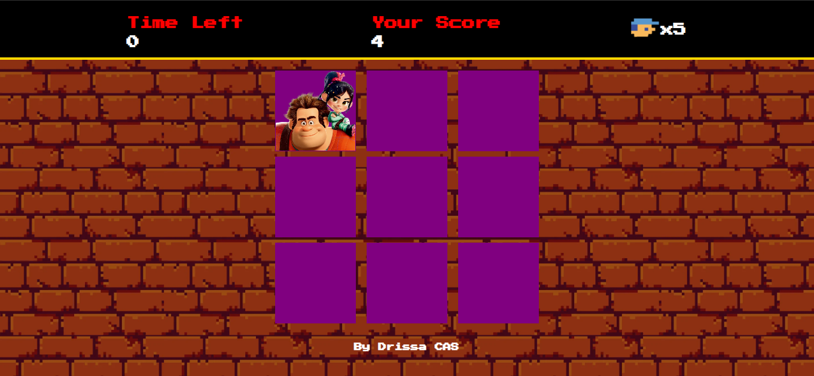

# Game Detona Ralph
Desafio do [Bootcamp da RiHappy na Dio.me](https://web.dio.me/track/f31d0ec6-b46a-47d6-b5ec-5dcd3766dacb).

Nesse desafio pude desenvolver habilidades do HTML, CSS e JavaScript. Nesse desafio utilizei um pouco dos conceitos de HTML semântica e organização de código e arquivos.
Separação de variaveis de acordo ao que cada variavel faz, se é algo interno ou visual. Fazer sempre funções bem definidas. Trabalhar com eventos e áudios.

Este foi o resultado final.
